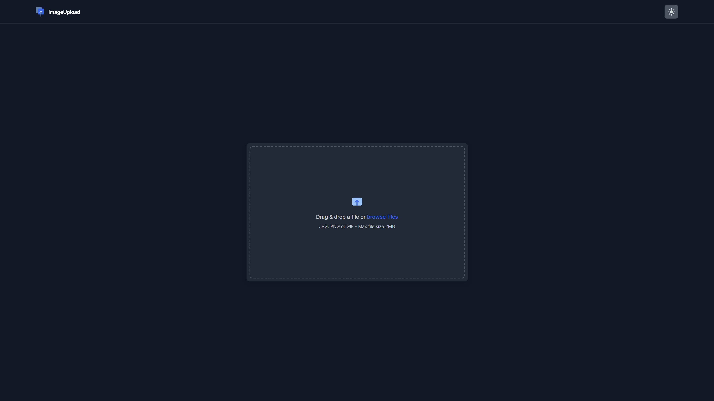

# Image Uploader Challenge

This is a solution to the [Image Uploader challenge on DevChallenges.io](devchallenges.io). DevChallenges.io help you improve your coding skills by building realistic projects.

## Table of contents

- [Overview](#overview)
  - [The challenge](#the-challenge)
  - [Screenshot](#screenshot)
  - [Links](#links)
- [My process](#my-process)
  - [Built with](#built-with)
  - [Useful resources](#useful-resources)
- [Author](#author)

## Overview

### The challenge

In full-stack development, a common task involves working with files. This challenge presents an opportunity to create a straightforward Image Upload application, enabling users to upload images.

### Screenshot

### Links

- [Solution URL](https://devchallenges.io/solution/14495)
- [Live Site URL](https://image-uploader-challenge-phi.vercel.app)

## My process

### Built with

- [Typescript](https://www.typescriptlang.org/) - Superset of JavaScript which adds static typing
- [React](https://reactjs.org/) - JS library
- [Vite](https://vite.dev/) - Next Generation Web Packager
- [Vercel Serverless Functions](https://vercel.com/docs/functions)

### Useful resources

- [MDN Web Docs](https://developer.mozilla.org/en-US/docs/Web/CSS) - This helped me learn how filters work in css.
- [Vercel Docs](https://vercel.com/docs) - All documentation of Vercel products

## Author

- Website - [Leonardo Rivero](https://codingleonardo.github.io/)
- DevChallenges.io - [@CodingLeonardo](https://devchallenges.io/profile/8c0bdef8-0f64-4c92-8640-bcae8d05fb4b)
- Twitter - [@CodingLeonardo](https://www.twitter.com/CodingLeonardo)
